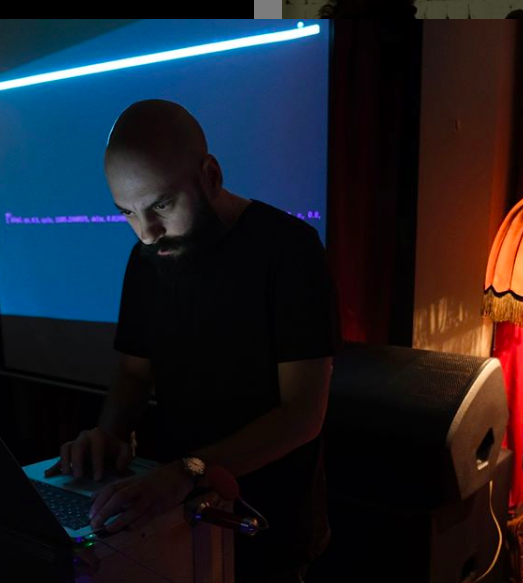

_This page tells you a little bit about me._

Konstantinos Vasilakos is an interdisciplinary artist working in the millieu of digital art and interactive media, and Electroacoustic Music. He is based in Istanbul and leads the Sonic Arts postgraduate studies path at the Center for Advanced Studies in Music [MIAM](https://www.miam.itu.edu.tr), in Istanbul Technical University. His [courses](https://konvas.github.io/teaching/) focus on the creation of interactive music, sound installations and algorithmic/non-linear composition. His research interests include sonification, new instruments for musical expression and live-coding with networked music systems. 

Some projects include Dark Matter, a live coding project with particle collision data from the Large Hadron Collider at CERN, in Switzerland. Among other things, he is the author of [IPSOS](http://ipsos.web.cern.ch/IPSOS_support_website/support.html), a web-based novel interface for real-time sounding of high-energy physics data from the LHC. It was commissioned by art@CMS, CERN and the University of Birmingham. It is used as an educational workshop for students and physics teachers as well as for interested laymen. He is also the author of numerous tailor-made software solutions for multidisciplinary work involving real-time sound reinforcement for body movement and dance, machine learning and neural networks for sound installations (see this [page](https://konvas.github.io/software/) page for a list of ongoing and past projects).

He has a PhD in music from Keele University in the UK and a master's degree from Utrecht School of Arts in the Netherlands. Some of his works are presented in France, the Netherlands, Germany, Czech Republic, Greece, Switzerland, Turkey and United Kingdom, and he has collaborated with leading research centers such as CERN in Switzerland and the Laboratoire ACROE/ICA at the University of Grenoble in France.

## Chunk No_reace

<iframe src="https://player.vimeo.com/video/395138259" width="640" height="360" frameborder="0" allow="autoplay; fullscreen" allowfullscreen></iframe>

I actively support and contribute to the community [Algorave] (https://algorave.com); sometimes I perform under the pseudonym Chunk No_reace. Chunk No_reace was educated in the oligarchy of pitch and rhythm and other requirements of intelligible music, but soon found himself caught up in the rules of incomprehensible and complex orders deeply rooted in silicon circuit boards and hardware devices. He creates post-electro-acoustic music using hitherto available computer music systems. Nowadays, he enjoys hacking code in front of audiences by changing the temporality of musical algorithms _on the fly_, also known as live-coding.

For a comprehensive CV click [here](./files/kv_one_page_cv-project-links.pdf)
