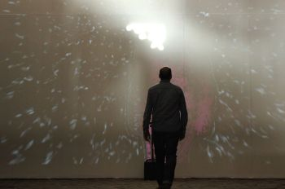

_This page tells you a little bit about me._

Konstantinos Vasilakos is an interdisciplinary artist working in the millieu of digital arts and interactive media and Electroacoustic Music. Based in Istanbul, he is leading the Sonic Arts department of the Center for Advanced Studies in Music [MIAM](https://www.miam.itu.edu.tr), in Istanbul Technical University (ITÜ). His [courses](https://konvas.github.io/teaching/) elaborate in the creation of interactive music, sound installations and algorithmic/non linear composition. His research interests involve sonification, new instruments for musical expression, and live coding with networked music systems. 

Some projects include Dark Matter, a live coding project using particle collision data that derived from the Large Hadron Collider at CERN, in Switzerland, and he is the author of a novel interface named [IPSOS](http://ipsos.web.cern.ch/IPSOS_support_website/support.html). It is designed to offer a platform for interactive sonification of high energy physics data. It was commisioned by art@CMS, at CERN and the University of Birmingham and it has been used in a plethora of workshops and education outreach events for students and teachers of physics. He has also authored numerous [software](https://konvas.github.io/software/) for the creation of interactive projects involving real time sonification of bodily movement and dance as well as machine learning and neural networks for sound installations (see my [projects](https://konvas.github.io/software/) page for more information).

He holds a PhD in Music from Keele University in the UK, and a Masters degree from the Utrecht School of the Arts, in the Netherlands. His works have been presented in France, The Netherlands, Germany, Czech Republic, Greece, Switzerland, Turkey, and the United Kingdom. He has collaborated with leading research centers such as CERN, in Switzerland, and the Laboratoire ACROE/ICA, at the University of Grenoble, in France. [CV download](./files/kv_one_page_cv-project-links.pdf)

_I am actively supporting and contributing in the [Algorave](https://algorave.com) community, of Istanbul and abroad; I sometimes perform under the alias which goes as Chunk No_Reace._
Chunk No_reace was educated in the realm of the oligarchy of pitch and rhythm of understandable music, albeit soon enough he found himself abiding with the rules of ungraspable and complex orders ingrained in electronic circuits, silicon boards and interactive interfaces operated by hardware paraphernalia. He creates post electro-acoustic music using hitherto available computer music systems within the milieu of digital arts Nowadays, he enjoys hacking code in front of the audience by altering temporality of musical algorithms while at run, aka live coding.
