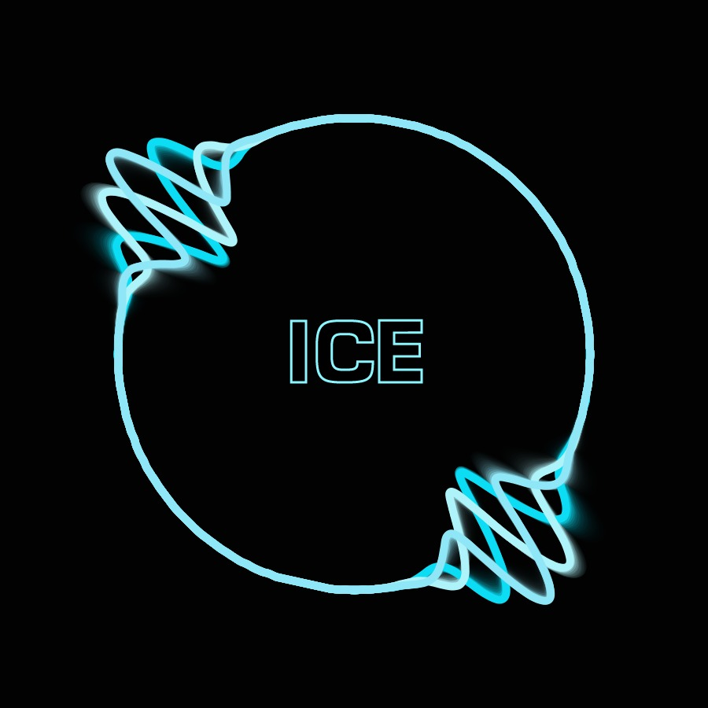

# Research
My research involves music networked systems, new instruments for musical expression, interactive environments using hardware devices, sonification and live-coding.

<a itemprop="sameAs" content="https://orcid.org/0000-0002-3058-0048" href="https://orcid.org/0000-0002-3058-0048" target="orcid.widget" rel="me noopener noreferrer" style="vertical-align:top;">https://orcid.org/0000-0002-3058-0048</a>

# Istanbul Coding Ensemble

| {:height="60%" width="40%"}                                                                       |
|:--------------------------------------------------------------------------------------------------------------------------:|
| *Istanbul Coding Ensemble Laptop Ensemble researching networked music performance and just in time programming techniques* |
| *Credit: ICE artwork made by Müge Pelin Şen*                                                                               |
|                                                                                                                            |

Istanbul Coding Ensemble, is a laptop ensemble which was founded on 2018 by Konstantinos Vasilakos and postgraduate students of ITU/MIAM. ICE performances focus on using improvisation as impetus to real time composition shaped by dialogues of the performers used as a means to create impromptu sonic outcomes.

## Milestones
- [x] 2018 the formation of the group heralded the inauguration of the Holly Church of Kairotic Coding in the Algotteranean region.

## Events
- 18 May 2022, Istanbul Technical University, EELISA Symposium [video](https://www.youtube.com/watch?v=rGSq-qR_0BA&t=1382s)
- International Conference in Live Coding, Valdivia, Chile [program](https://iclc.toplap.org/2021/papers.html)
- International Symposium in Music Information Retrieval, Online, The Internet [program](https://ismir2021.ismir.net/music/#symphony-in-blue-20)
- 21 June 2021, University of Bristol, UK. [video](https://youtu.be/vMXCswvoV2E)
- 10 June 2018. Arter, Istanbul, Turkey [video](https://www.youtube.com/watch?v=fsUI83MMogg&t=1445s)
- 9 April 2019 Sabanci University, Istanbul, Turkey [event-link](https://fass.sabanciuniv.edu/tr/event-detail?nid=20385)
- 11 April 2019 ITU/MIAM, The Multivalent Voice in Transcultural Music-making [snippet-video](https://www.facebook.com/itumiam/videos/579657199209878)
- 30 October 2019 ITU/MIAM, ICE meets [PBU](http://wertlos.org/pbup/) [event-page](https://www.miam.itu.edu.tr/en/2019/10/25/pbu-meets-ice-laptop-performance-using-networked-music-systems-2/)
